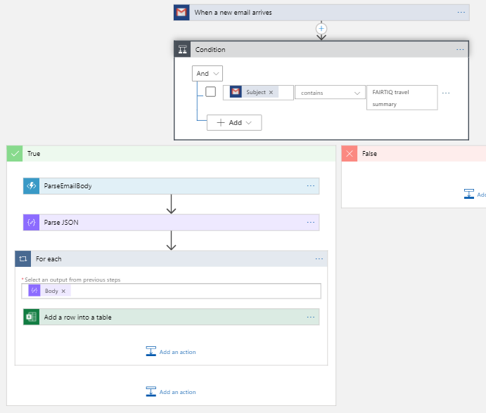

# FairtiqParser

## Purpose

[Fairtiq](https://fairtiq.com/fr-ch/) sends daily travel summary emails:


This Azure function is intended to be used in an Azure logic app. 



To add the journeys in an Excel table.


## Wortking principle

It takes the [email body](FairtiqParser.Tests/ressources/body.html) as input and returns the journey as JSON:

```json
{
    "items": {
        "properties": {
            "ArrivalTime": {
                "type": "string"
            },
            "Cost": {
                "type": "string"
            },
            "Date": {
                "type": "string"
            },
            "DepartureTime": {
                "type": "string"
            },
            "Destination": {
                "type": "string"
            },
            "Start": {
                "type": "string"
            }
        },
        "required": [
            "Date",
            "DepartureTime",
            "Start",
            "ArrivalTime",
            "Destination",
            "Cost"
        ],
        "type": "object"
    },
    "type": "array"
}
```
## Ressources
[Tutorial: Automate tasks to process emails by using Azure Logic Apps, Azure Functions, and Azure Storage](https://docs.microsoft.com/en-us/azure/logic-apps/tutorial-process-email-attachments-workflow)
[Data security and privacy policies for Google connectors in Azure Logic Apps](https://docs.microsoft.com/fr-fr/azure/connectors/connectors-google-data-security-privacy-policy)
[Gmail connector](https://docs.microsoft.com/fr-fr/connectors/gmail/#authentication-and-bring-your-own-application)
